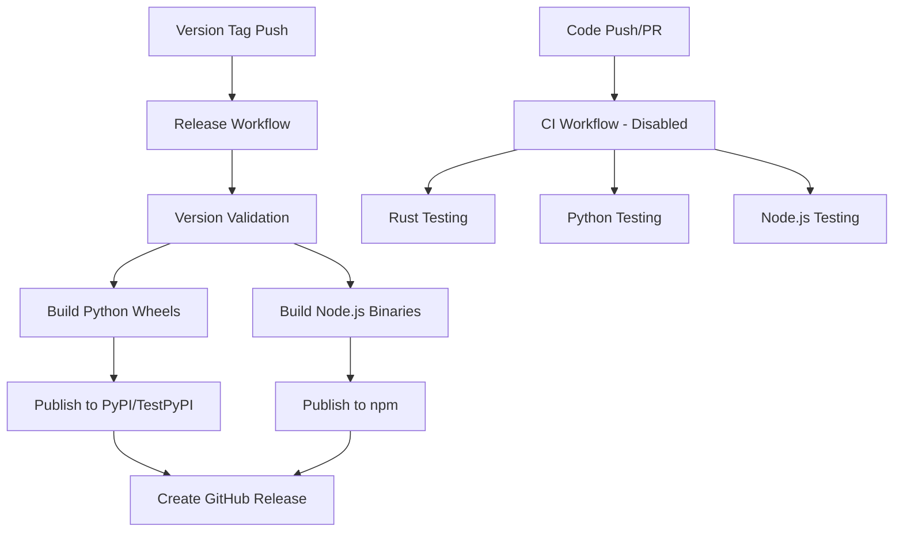

# Specado CI/CD Pipeline Documentation

This document provides comprehensive documentation of the Specado project's CI/CD pipeline, covering automated testing, building, deployment, and release processes.

## Table of Contents

- [Pipeline Overview](#pipeline-overview)
- [Workflow Architecture](#workflow-architecture)
- [Development Workflows](#development-workflows)
- [Build and Test Process](#build-and-test-process)
- [Quality Assurance](#quality-assurance)
- [Deployment and Release](#deployment-and-release)
- [Troubleshooting](#troubleshooting)
- [Maintenance and Monitoring](#maintenance-and-monitoring)

## Pipeline Overview

The Specado CI/CD pipeline is built on GitHub Actions and supports a multi-language Rust workspace with Python and Node.js bindings. The pipeline emphasizes:

- **Tag-based releases**: Automatic deployment triggered by version tags
- **Cross-platform builds**: Native binaries for multiple platforms and architectures
- **Multi-language testing**: Comprehensive testing across Rust, Python, and Node.js
- **Security-first**: Keyless publishing with OpenID Connect (OIDC) authentication
- **Quality gates**: Automated formatting, linting, and security auditing

### Core Components



## Workflow Architecture

### 1. Release Workflow (.github/workflows/release.yml)

**Triggers**: Push to tags matching `v*`, `py-v*`, or `node-v*`

**Key Features**:
- Semantic version validation and release type detection
- Cross-platform builds for Windows, macOS, and Linux
- Multi-architecture support (x86_64, ARM64)
- Conditional publishing based on release type
- Automated GitHub release creation with artifacts

**Jobs Overview**:

| Job | Purpose | Platforms | Dependencies |
|-----|---------|-----------|--------------|
| `validate-version` | Version consistency checks | ubuntu-latest | None |
| `build-python-wheels` | Build Python distributions | ubuntu, macos, windows | validate-version |
| `publish-python` | Publish to PyPI/TestPyPI | ubuntu-latest | build-python-wheels |
| `build-node-binaries` | Build native Node.js modules | ubuntu, macos, windows | validate-version |
| `publish-node` | Publish to npm registry | ubuntu-latest | build-node-binaries |
| `create-github-release` | Create GitHub release | ubuntu-latest | publish-python, publish-node |

### 2. Version Bump Helper (.github/workflows/version-bump.yml)

**Triggers**: Manual workflow dispatch

**Purpose**: Streamlines version management across the workspace

**Features**:
- Semantic version validation
- Automated version updates across all package files
- Optional tag creation and push
- Git commit with standardized message format

### 3. CI Workflow (Disabled - .github/workflows/ci.yml.disabled)

**Purpose**: Continuous integration testing (currently disabled)

**Planned Features**:
- Rust core library testing with clippy and rustfmt
- Python binding validation across multiple Python versions
- Node.js binding testing with multiple Node.js versions
- Cross-platform compatibility testing

## Development Workflows

### Local Development Setup

Reference: [DEVELOPMENT.md:16-441](file:///Users/jfeinblum/code/specado/DEVELOPMENT.md)

1. **Environment Setup**:
   ```bash
   # Rust toolchain (minimum 1.77.0)
   rustup component add rustfmt clippy
   
   # Python development tools
   pip install maturin[patchelf] pytest black ruff
   
   # Node.js development tools
   npm install -g @napi-rs/cli
   ```

2. **Local Testing**:
   ```bash
   # Simulate CI checks locally
   cargo fmt --all -- --check
   cargo clippy --all-targets --all-features -- -D warnings
   cargo test --all
   cargo audit
   ```

### Pull Request Workflow

**Current State**: No automated PR checks (CI workflow disabled)

**Recommended Manual Checks**:
1. Code formatting validation
2. Linting and clippy checks
3. Unit test execution
4. Security audit
5. Build verification across components

### Branch Protection Strategy

**Recommended Configuration**:
- Require PR reviews from code owners
- Require status checks to pass (when CI is enabled)
- Require branches to be up to date before merging
- Restrict pushes to main branch

## Build and Test Process

### Rust Workspace Configuration

**Source**: [Cargo.toml:1-47](file:///Users/jfeinblum/code/specado/Cargo.toml)

```toml
[workspace]
resolver = "2"
members = ["specado-core", "specado-python", "specado-node"]

[workspace.package]
version = "0.2.0"                    # Single source of truth
rust-version = "1.89.0"             # Minimum Rust version
license = "Apache-2.0"              # Consistent licensing
```

**Build Optimization**:
- LTO enabled for release builds ([Cargo.toml:34-38](file:///Users/jfeinblum/code/specado/Cargo.toml))
- Single codegen unit for maximum optimization
- Debug symbols stripped in release mode

### Python Binding Build Process

**Configuration**: [specado-python/pyproject.toml:1-68](file:///Users/jfeinblum/code/specado/specado-python/pyproject.toml)

**Build Pipeline**:
1. **Maturin Setup**: Uses PyO3 with maturin build backend
2. **Cross-Platform Wheels**: 
   - Linux: Uses manylinux containers with OpenSSL dependencies
   - macOS: Builds both x86_64 and ARM64 wheels
   - Windows: MSVC toolchain with OpenSSL configuration
3. **Python Version Support**: 3.9 through 3.12
4. **Dynamic Versioning**: Version pulled from Cargo.toml workspace

**Key Build Steps** ([release.yml:69-118](file:///Users/jfeinblum/code/specado/.github/workflows/release.yml)):
```yaml
- name: Build wheels
  uses: PyO3/maturin-action@v1
  with:
    target: x86_64
    args: --release --out dist --manifest-path specado-python/Cargo.toml
    manylinux: auto
    before-script-linux: "yum install -y openssl-devel pkgconfig || apt-get update && apt-get install -y libssl-dev pkg-config"
```

### Node.js Binding Build Process

**Configuration**: [specado-node/package.json:1-121](file:///Users/jfeinblum/code/specado/specado-node/package.json)

**NAPI-RS Targets**:
- macOS: x86_64 and ARM64
- Linux: x86_64 and ARM64 (with cross-compilation using Zig)
- Windows: x86_64 (ARM64 planned)

**Cross-Compilation Setup** ([release.yml:182-192](file:///Users/jfeinblum/code/specado/.github/workflows/release.yml)):
```bash
# Zig-based cross-compilation for Linux ARM64
curl -L https://ziglang.org/download/0.11.0/zig-linux-x86_64-0.11.0.tar.xz | tar -xJ
cargo install cargo-zigbuild
```

**Build Matrix** ([release.yml:155-164](file:///Users/jfeinblum/code/specado/.github/workflows/release.yml)):
- 5 platform/architecture combinations
- Fail-fast disabled for comprehensive coverage
- Conditional cross-compilation for ARM64 Linux

### Testing Strategy

**Rust Core Testing**:
- Unit tests with `cargo test`
- Integration tests with external dependencies
- Property-based testing with `proptest`
- Benchmark tests with `criterion`

**Python Binding Testing**:
- FFI validation through Python test scripts
- pytest-based testing framework
- Python version matrix testing (planned)

**Node.js Binding Testing**:
- Native module loading verification
- Jest/Node.js test runner integration
- Cross-platform compatibility testing

## Quality Assurance

### Code Formatting

**Rust**: `rustfmt` with workspace-level configuration
```bash
cargo fmt --all -- --check
```

**Python**: `black` and `ruff` integration ([pyproject.toml:57-63](file:///Users/jfeinblum/code/specado/specado-python/pyproject.toml))
```toml
[tool.black]
line-length = 100
target-version = ["py39"]
```

### Linting and Static Analysis

**Rust**: `clippy` with strict warning enforcement
```bash
cargo clippy --all-targets --all-features -- -D warnings
```

**Python**: `ruff` for fast Python linting and `mypy` for type checking

**Node.js**: ESLint configuration for JavaScript/TypeScript validation

### Security Auditing

**Rust Dependencies**: `cargo audit` for vulnerability scanning
```bash
cargo audit
```

**Dependency Management**:
- Regular dependency updates via workspace configuration
- Version pinning for security-critical dependencies
- Automated vulnerability scanning in CI

### Performance Testing

**Benchmark Framework**: Criterion.rs for Rust performance testing
```rust
[dev-dependencies]
criterion = { workspace = true }
```

## Deployment and Release

### Release Types and Triggers

**Tag-Based Release System**:

| Tag Pattern | Release Type | PyPI Target | npm Tag | Description |
|-------------|--------------|-------------|---------|-------------|
| `v1.0.0` | Stable | PyPI | latest | Production-ready release |
| `v1.0.0-rc.1` | Pre-release | TestPyPI | beta | Release candidate |
| `v1.0.0-beta.1` | Pre-release | TestPyPI | beta | Beta version |
| `v1.0.0-alpha.1` | Alpha | TestPyPI | alpha | Early development |
| `py-v1.0.0` | Python-only | PyPI | N/A | Python package only |
| `node-v1.0.0` | Node-only | N/A | latest | Node.js package only |

### Version Management

**Single Source of Truth**: [Cargo.toml:10](file:///Users/jfeinblum/code/specado/Cargo.toml)

**Version Validation** ([release.yml:53-67](file:///Users/jfeinblum/code/specado/.github/workflows/release.yml)):
```bash
CARGO_VERSION=$(awk '/^\[workspace\.package\]/{f=1} f && /^version/{print $3; exit}' Cargo.toml | tr -d '"')
TAG_VERSION="${{ steps.extract.outputs.version }}"
```

**Automated Version Updates** ([version-bump.yml:39-61](file:///Users/jfeinblum/code/specado/.github/workflows/version-bump.yml)):
- Workspace Cargo.toml update
- Node.js package.json synchronization
- Optional Python pyproject.toml update

### Publishing Strategy

#### PyPI Publishing

**Authentication**: OpenID Connect (OIDC) with Trusted Publishers
- No stored secrets required
- Enhanced security through GitHub Actions integration
- Separate configuration for PyPI and TestPyPI

**Package Distribution** ([release.yml:137-147](file:///Users/jfeinblum/code/specado/.github/workflows/release.yml)):
```yaml
- name: Publish to PyPI
  if: needs.validate-version.outputs.is_prerelease == 'false'
  uses: pypa/gh-action-pypi-publish@release/v1
```

#### npm Publishing

**Authentication**: NPM_TOKEN stored as GitHub Secret
**Tag Strategy** ([release.yml:227-233](file:///Users/jfeinblum/code/specado/.github/workflows/release.yml)):
```yaml
case "${{ needs.validate-version.outputs.release_type }}" in
  stable)     echo "tag=latest" ;;
  prerelease) echo "tag=beta"   ;;
  *)          echo "tag=alpha"  ;;
esac
```

### Artifact Management

**GitHub Release Creation**:
- Automated release notes generation
- Python wheel attachments
- Node.js binary attachments
- Pre-release marking based on version

**Artifact Storage**:
- Cross-platform wheel collection
- Native binary aggregation
- Secure artifact transfer between jobs

## Troubleshooting

### Common Build Issues

#### Version Mismatch Errors

**Symptom**: "Version mismatch" error during release validation
**Cause**: Tag version doesn't match Cargo.toml workspace version
**Solution**:
```bash
# Check current version
grep '^version' specado-core/Cargo.toml

# Ensure tag matches workspace version
git tag v$(grep '^version' Cargo.toml | cut -d'"' -f2)
```

#### Python Wheel Build Failures

**OpenSSL Issues**:
```bash
# Linux: Install OpenSSL development headers
yum install -y openssl-devel pkgconfig
# or
apt-get install -y libssl-dev pkg-config
```

**maturin Configuration**:
```bash
# Verify maturin installation
pip install maturin[patchelf]

# Debug build issues
maturin build --release --manifest-path specado-python/Cargo.toml
```

#### Node.js Cross-Compilation Issues

**ARM64 Linux Cross-Compilation**:
```bash
# Verify Zig installation
zig version

# Check cross-compilation environment
echo $CARGO_TARGET_AARCH64_UNKNOWN_LINUX_GNU_LINKER
```

### Publishing Failures

#### PyPI Authentication Issues

**OIDC Configuration**:
1. Verify Trusted Publisher setup at https://pypi.org/manage/account/publishing/
2. Check workflow name matches: `release.yml`
3. Ensure proper repository and organization configuration

#### npm Token Issues

**Token Validation**:
```bash
# Verify token has publish permissions
npm whoami --registry https://registry.npmjs.org
```

### CI/CD Monitoring

#### Workflow Status Monitoring

**GitHub Actions Interface**:
- Monitor workflow runs at https://github.com/specado/specado/actions
- Check individual job logs for detailed error information
- Review artifact upload/download status

**Notification Setup**:
- Configure GitHub notifications for workflow failures
- Set up Slack/Discord integration for release notifications
- Monitor package registry status pages

### Performance Optimization

#### Build Time Optimization

**Rust Compilation**:
```bash
# Enable incremental compilation for development
export CARGO_INCREMENTAL=1

# Use sccache for distributed compilation caching
cargo install sccache
```

**Parallel Builds**:
- Matrix strategy enables parallel platform builds
- Artifact caching reduces redundant work
- Conditional job execution based on tag patterns

## Maintenance and Monitoring

### Regular Maintenance Tasks

#### Security Updates

**Quarterly Tasks**:
1. Update Rust toolchain version
2. Audit and update dependencies
3. Rotate npm authentication tokens
4. Review OIDC configuration

**Automated Monitoring**:
```bash
# Set up dependabot for automated dependency updates
# Configure cargo audit in CI for vulnerability scanning
cargo audit --db /path/to/advisory-db
```

#### Infrastructure Updates

**GitHub Actions Maintenance**:
- Update action versions quarterly
- Monitor action deprecation notices
- Test workflow changes in feature branches

**Platform Support**:
- Monitor Python version EOL schedules
- Track Node.js LTS release cycles
- Update target platform matrix as needed

### Monitoring and Alerting

#### Package Registry Monitoring

**PyPI Package Health**:
- Monitor download statistics
- Track installation success rates
- Review user feedback and issues

**npm Package Monitoring**:
- Monitor package download metrics
- Track version adoption rates
- Review package vulnerability reports

#### Release Success Metrics

**Key Performance Indicators**:
- Release frequency and consistency
- Build success rates across platforms
- Time from tag creation to package availability
- User adoption of new releases

**Alerting Configuration**:
- Workflow failure notifications
- Package registry publishing failures
- Security vulnerability alerts
- Performance regression detection

### Documentation Maintenance

#### Release Documentation

**Release Process Updates**: [RELEASING.md:1-263](file:///Users/jfeinblum/code/specado/RELEASING.md)
- Keep release procedures current
- Document lessons learned from releases
- Update troubleshooting guides

#### Development Documentation

**CI/CD Pipeline Updates**:
- Document workflow changes
- Update local development procedures
- Maintain troubleshooting knowledge base

### Continuous Improvement

#### Pipeline Optimization

**Performance Metrics**:
- Track workflow execution times
- Monitor artifact sizes and transfer times
- Optimize build matrices for efficiency

**Feature Enhancement**:
- Evaluate new GitHub Actions features
- Consider advanced deployment strategies
- Implement additional quality gates

#### Developer Experience

**Tooling Improvements**:
- Streamline local development workflows
- Enhance debugging capabilities
- Improve error messages and documentation

**Process Automation**:
- Expand automated testing coverage
- Implement advanced release automation
- Enhance monitoring and alerting systems

---

## Quick Reference

### Common Commands

```bash
# Local CI simulation
cargo fmt --all -- --check
cargo clippy --all-targets --all-features -- -D warnings
cargo test --all
cargo audit

# Version management
grep '^version' Cargo.toml
git tag v1.0.0 && git push origin v1.0.0

# Manual build testing
cd specado-python && maturin build --release
cd specado-node && npm run build
```

### Key File References

- **Workflow Configuration**: [.github/workflows/release.yml](file:///Users/jfeinblum/code/specado/.github/workflows/release.yml)
- **Version Management**: [.github/workflows/version-bump.yml](file:///Users/jfeinblum/code/specado/.github/workflows/version-bump.yml)
- **Workspace Configuration**: [Cargo.toml](file:///Users/jfeinblum/code/specado/Cargo.toml)
- **Python Package Config**: [specado-python/pyproject.toml](file:///Users/jfeinblum/code/specado/specado-python/pyproject.toml)
- **Node.js Package Config**: [specado-node/package.json](file:///Users/jfeinblum/code/specado/specado-node/package.json)
- **Development Setup**: [DEVELOPMENT.md](file:///Users/jfeinblum/code/specado/DEVELOPMENT.md)
- **Release Process**: [RELEASING.md](file:///Users/jfeinblum/code/specado/RELEASING.md)

### Support Resources

- **GitHub Issues**: https://github.com/specado/specado/issues
- **Actions Logs**: https://github.com/specado/specado/actions
- **PyPI Package**: https://pypi.org/project/specado/
- **npm Package**: https://www.npmjs.com/package/specado
- **Releases**: https://github.com/specado/specado/releases

This documentation provides a comprehensive overview of the Specado CI/CD pipeline. For specific implementation details, refer to the linked configuration files and workflow definitions.